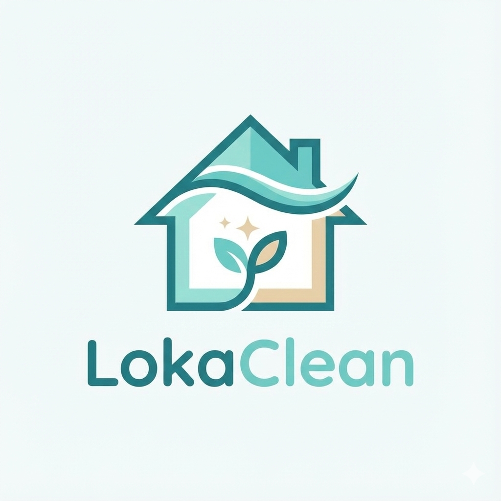
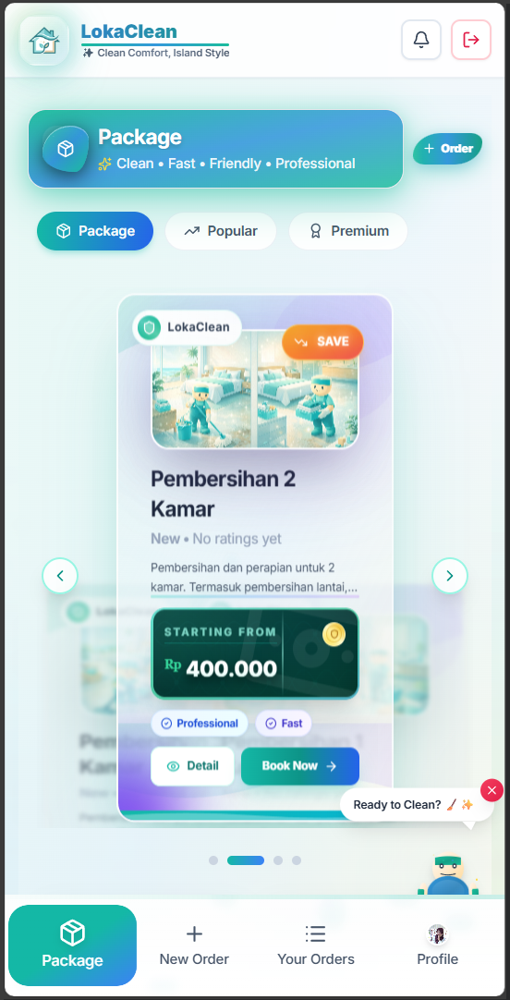

# LokaClean — Cleaning Service Marketplace (Web & PWA)

<div align="center">
  
</div>


<div align="center">
  
  <p><em>Tampilan Aplikasi LokaClean</em></p>
</div>

**LokaClean** adalah platform marketplace jasa kebersihan berbasis web dan PWA (Progressive Web App) yang menghubungkan pengguna dengan penyedia layanan kebersihan profesional. Aplikasi ini dirancang dengan pendekatan *mobile-first* untuk memberikan pengalaman pengguna yang mulus, lengkap dengan fitur pemilihan lokasi berbasis peta, manajemen pesanan real-time, dan dukungan multibahasa.

## Fitur Utama

*   🧹 **Pemesanan Fleksibel**: Berbagai pilihan paket kebersihan yang dapat disesuaikan (Mendukung Bahasa Indonesia & Inggris).
*   📍 **Lokasi Berbasis Peta**: Integrasi Leaflet/OpenStreetMap untuk penentuan titik lokasi pembersihan yang akurat.
*   📱 **PWA Ready**: Dapat diinstal dan dijalankan layaknya aplikasi native di perangkat mobile.
*   💳 **Pembayaran Terintegrasi**: Dukungan gateway pembayaran (Midtrans) untuk transaksi yang aman dan mudah.
*   🔔 **Real-time Updates**: Notifikasi status pesanan dan sistem pelacakan progres layanan.
*   ⭐ **Ulasan & Rating**: Sistem penilaian untuk menjaga kualitas layanan mitra kebersihan.
*   🛠️ **Admin Dashboard**: Panel admin untuk manajemen pengguna, paket, pesanan, dan laporan keuangan.

## Tech Stack

*   **Frontend**: React, TypeScript, Vite, Tailwind CSS, Framer Motion, Leaflet.
*   **Backend**: Node.js, Express, TypeScript, Prisma ORM, PostgreSQL.
*   **Lainnya**: JWT Authentication, PWA Support.

## Struktur Project

This repository contains:

- **`backend/`**: Node.js + Express + TypeScript REST API, PostgreSQL via Prisma, JWT auth, role-based access, and photo upload support.
- **`frontend/`**: React + TypeScript + Vite + Tailwind UI, mobile-first, PWA-ready, with map-based location picking (Leaflet/OpenStreetMap).

### Quick start (local)

- **1) Prepare PostgreSQL (NO Docker)**

You can use **local PostgreSQL** (recommended for dev) or a **cloud PostgreSQL** (Neon/Supabase/etc).

Local example (create DB + user once):

```sql
-- Run in psql/pgAdmin:
CREATE USER lokaclean WITH PASSWORD 'lokaclean';
CREATE DATABASE lokaclean OWNER lokaclean;
GRANT ALL PRIVILEGES ON DATABASE lokaclean TO lokaclean;
```

Then set `DATABASE_URL` in `backend/.env` (example below).

- **2) Backend**

```bash
cd backend
cp env.example .env
npm install
npm run prisma:generate
npm run prisma:migrate
npm run db:seed
npm run dev
```

- **3) Frontend**

```bash
cd frontend
cp env.example .env
npm install
npm run dev
```

### Default seeded admin (local)

- **Email**: `admin@lokaclean.local`
- **Password**: `admin12345`

> Change these immediately for any non-local environment.
