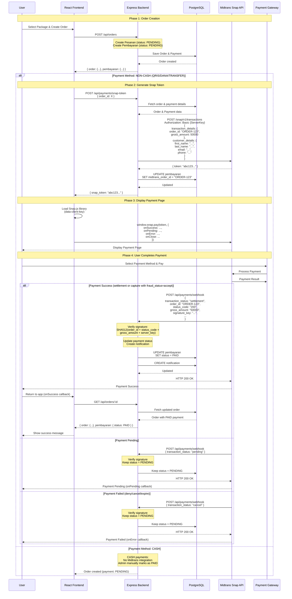
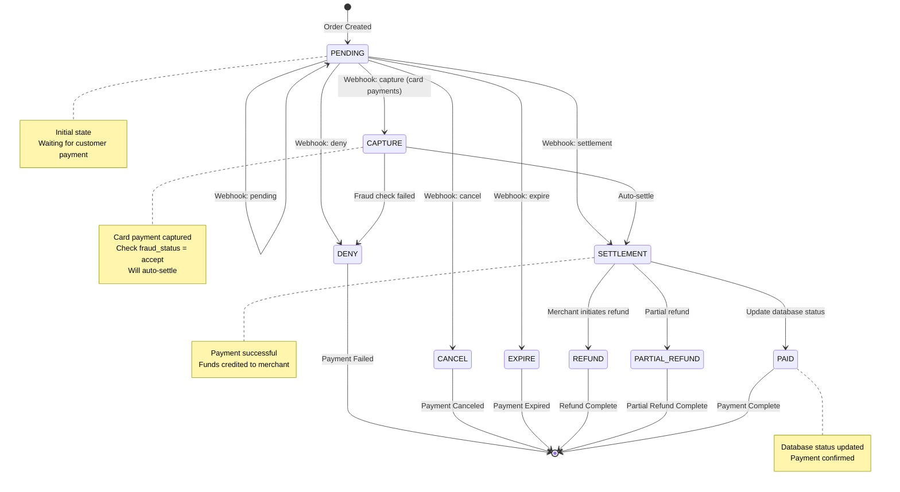
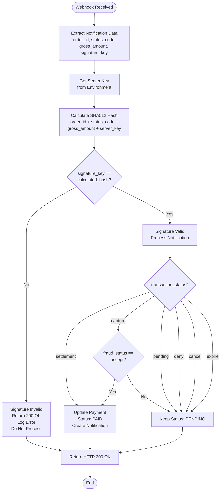
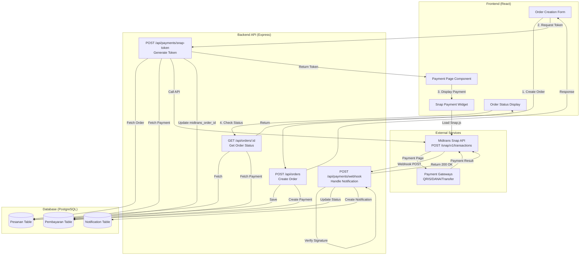
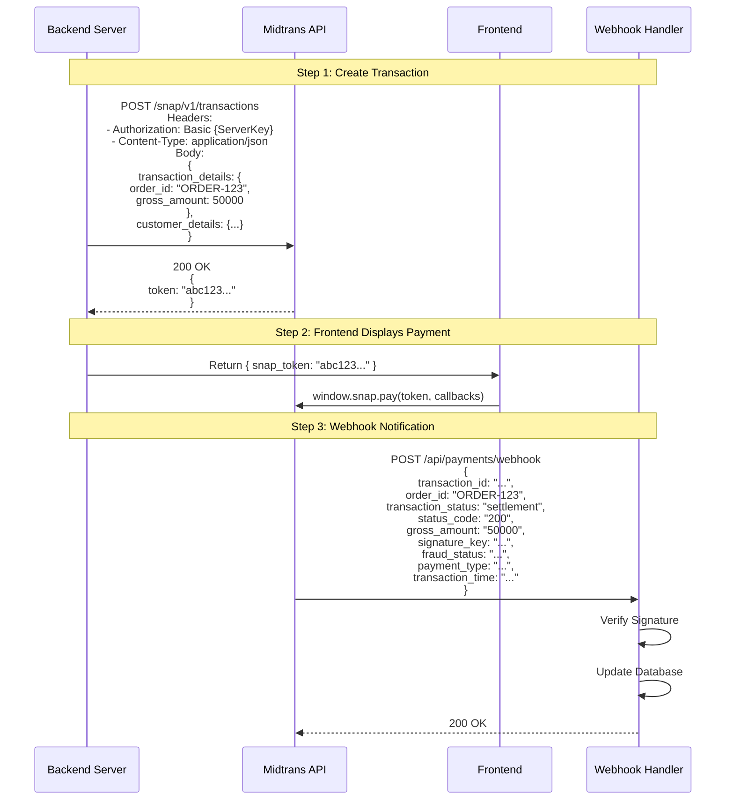
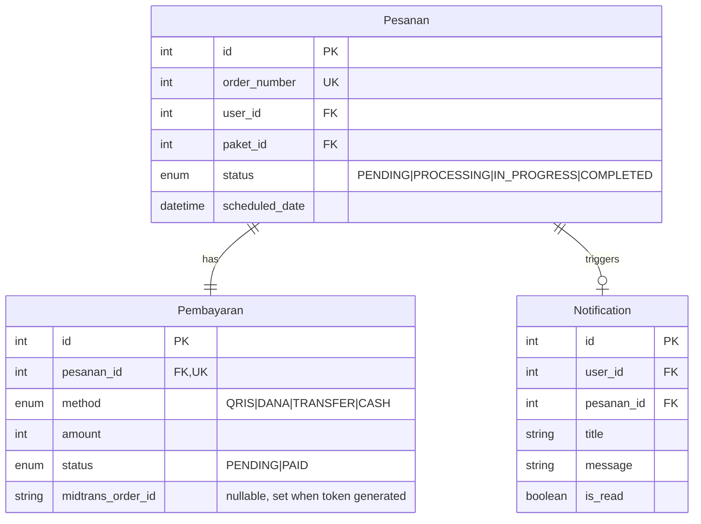

# Midtrans Payment Gateway Integration Flow

## Overview
This document explains how Midtrans payment gateway integration works in the LocaClean application, based on the official Midtrans Snap API documentation. The integration uses Midtrans Snap API for handling online payments (QRIS, DANA, TRANSFER) while CASH payments are handled manually.

## Official Midtrans Snap API Integration

### Backend Integration
- **SDK**: Use `midtrans-client` NPM package
- **API Endpoint**: `POST /snap/v1/transactions`
- **Authentication**: Basic Auth with Server Key
- **Response**: Returns `{ token: "..." }` for frontend use

### Frontend Integration
- **Library**: Include Midtrans Snap.js from CDN
- **Method**: `window.snap.pay(token, callbacks)`
- **Callbacks**: `onSuccess`, `onPending`, `onError`, `onClose`

### Webhook Notifications
- **Method**: HTTP POST to configured webhook URL
- **Signature Verification**: SHA512 hash of `order_id + status_code + gross_amount + server_key`
- **Response Requirement**: Always return HTTP 200 OK

## Main Payment Flow Sequence Diagram



## Transaction Status State Machine

Based on official Midtrans documentation, the complete transaction status flow:



## Official Transaction Status Definitions

According to Midtrans documentation:

- **`settlement`**: Transaction settled, funds credited to merchant account
- **`capture`**: Transaction successful, card balance captured. Will settle automatically. Check `fraud_status` = `accept` for success
- **`pending`**: Transaction created, awaiting customer payment or 3DS/OTP completion
- **`deny`**: Payment rejected by provider or Midtrans Fraud Detection System
- **`cancel`**: Transaction canceled, can be triggered by merchant
- **`expire`**: Transaction unavailable due to delayed payment
- **`failure`**: Unexpected error during processing
- **`refund`**: Transaction marked for refund by merchant
- **`partial_refund`**: Transaction marked for partial refund by merchant
- **`authorize`**: For pre-authorize feature - card balance reserved, can be captured or auto-released

### Success Criteria
A transaction is considered successful if:
- `transaction_status` is `settlement`, OR
- `transaction_status` is `capture` AND `fraud_status` is `accept`

## Webhook Verification Flow



## Component Architecture



## API Request/Response Flow



## Code Examples

### Backend: Create Snap Transaction (Node.js)

```javascript
const midtransClient = require('midtrans-client');

// Initialize Snap API instance
const snap = new midtransClient.Snap({
  isProduction: false, // Set to true for production
  serverKey: process.env.MIDTRANS_SERVER_KEY
});

// Create transaction
const parameter = {
  transaction_details: {
    order_id: "ORDER-123456",
    gross_amount: 50000
  },
  credit_card: {
    secure: true
  },
  customer_details: {
    first_name: "John",
    last_name: "Doe",
    email: "john.doe@example.com",
    phone: "08111222333"
  }
};

snap.createTransaction(parameter)
  .then((transaction) => {
    const transactionToken = transaction.token;
    // Return token to frontend
    return { snap_token: transactionToken };
  })
  .catch((error) => {
    console.error('Error creating transaction:', error);
    throw error;
  });
```

### Backend: Handle Webhook Notification (Node.js)

```javascript
const midtransClient = require('midtrans-client');
const crypto = require('crypto');

// Initialize Snap API instance
const apiClient = new midtransClient.Snap({
  isProduction: false,
  serverKey: process.env.MIDTRANS_SERVER_KEY
});

// Handle webhook notification
async function handleWebhook(notificationJson) {
  // Verify signature
  const serverKey = process.env.MIDTRANS_SERVER_KEY;
  const signatureKey = crypto
    .createHash('sha512')
    .update(
      notificationJson.order_id +
      notificationJson.status_code +
      notificationJson.gross_amount +
      serverKey
    )
    .digest('hex');

  if (notificationJson.signature_key !== signatureKey) {
    console.error('Invalid signature');
    return; // Still return 200 OK
  }

  // Process notification using SDK
  const statusResponse = await apiClient.transaction.notification(notificationJson);
  
  const orderId = statusResponse.order_id;
  const transactionStatus = statusResponse.transaction_status;
  const fraudStatus = statusResponse.fraud_status;

  // Handle transaction status
  if (transactionStatus === 'capture') {
    if (fraudStatus === 'accept') {
      // Update payment status to PAID
      await updatePaymentStatus(orderId, 'PAID');
    }
  } else if (transactionStatus === 'settlement') {
    // Update payment status to PAID
    await updatePaymentStatus(orderId, 'PAID');
  } else if (
    transactionStatus === 'cancel' ||
    transactionStatus === 'deny' ||
    transactionStatus === 'expire'
  ) {
    // Keep status as PENDING (payment failed)
    // Optionally log the failure
  } else if (transactionStatus === 'pending') {
    // Keep status as PENDING (waiting for payment)
  }

  // Always return 200 OK
  return { status: 'ok' };
}
```

### Frontend: Display Payment Page (React/JavaScript)

```html
<!-- Include Snap.js library -->
<script
  type="text/javascript"
  src="https://app.sandbox.midtrans.com/snap/snap.js"
  data-client-key="YOUR_CLIENT_KEY"
></script>
<!-- Production: https://app.midtrans.com/snap/snap.js -->
```

```javascript
// After receiving token from backend
function handlePayment(snapToken) {
  window.snap.pay(snapToken, {
    onSuccess: function(result) {
      // Payment successful
      console.log('Payment success:', result);
      // Redirect or update UI
      window.location.href = '/orders/' + result.order_id;
    },
    onPending: function(result) {
      // Payment pending
      console.log('Payment pending:', result);
      // Show pending message to user
      alert('Waiting for your payment!');
    },
    onError: function(result) {
      // Payment failed
      console.log('Payment failed:', result);
      // Show error message
      alert('Payment failed!');
    },
    onClose: function() {
      // User closed payment popup
      console.log('Payment popup closed');
      alert('You closed the popup without finishing the payment');
    }
  });
}
```

## Database Schema



## Security Considerations

1. **Webhook Signature Verification**: Always verify Midtrans webhook signatures using SHA512 hash to prevent fraud
   - Formula: `SHA512(order_id + status_code + gross_amount + server_key)`
   - Compare with `signature_key` from notification

2. **Idempotency**: Handle duplicate webhook notifications gracefully
   - Check if payment status already updated before processing
   - Always return HTTP 200 OK even for duplicates

3. **Order ID Format**: Use unique, non-guessable order IDs
   - Format: `ORDER-{timestamp}-{random}` or use UUID
   - Must be unique per transaction

4. **HTTPS Only**: All webhook endpoints must use HTTPS in production
   - Midtrans requires HTTPS for webhook URLs
   - Never use HTTP in production

5. **Key Security**:
   - Never expose Midtrans Server Key in frontend code
   - Store Server Key in environment variables
   - Client Key can be exposed in frontend (used for Snap.js)

6. **Response Requirement**: Webhook handler must always return HTTP 200 OK
   - Even for invalid signatures or errors
   - Midtrans will retry if non-200 response received

## Implementation Checklist

- [ ] Install `midtrans-client` NPM package
- [ ] Configure environment variables (Server Key, Client Key)
- [ ] Create `POST /api/payments/snap-token` endpoint
- [ ] Create `POST /api/payments/webhook` endpoint with signature verification
- [ ] Implement transaction status handling (settlement, capture, pending, deny, cancel, expire)
- [ ] Update frontend to include Snap.js library
- [ ] Implement `window.snap.pay()` with callbacks
- [ ] Handle payment status updates in database
- [ ] Create user notifications for payment status changes
- [ ] Add error handling and logging
- [ ] Test with Midtrans sandbox environment
- [ ] Configure production webhook URL in Midtrans dashboard
- [ ] Set up HTTPS for webhook endpoint in production

## References

- [Midtrans Snap Integration Guide](https://docs.midtrans.com/docs/snap-snap-integration-guide)
- [Midtrans Webhook Documentation](https://docs.midtrans.com/docs/https-notification-webhooks)
- [Midtrans Node.js Client](https://github.com/Midtrans/midtrans-nodejs-client)
